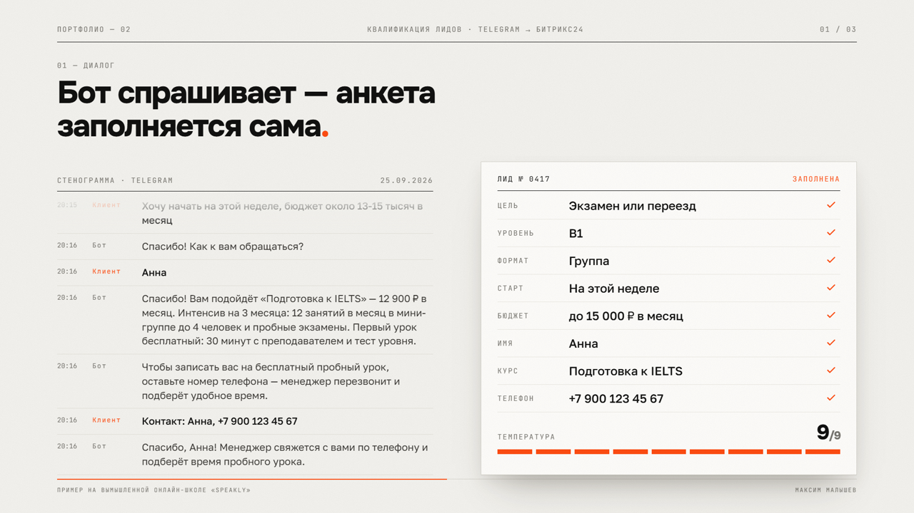
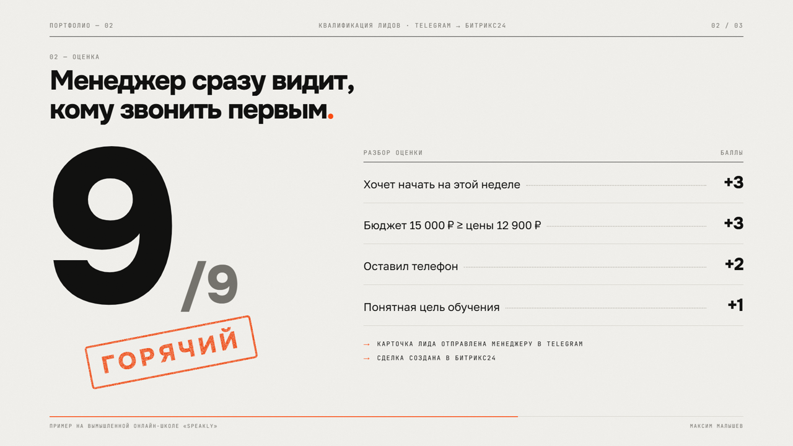
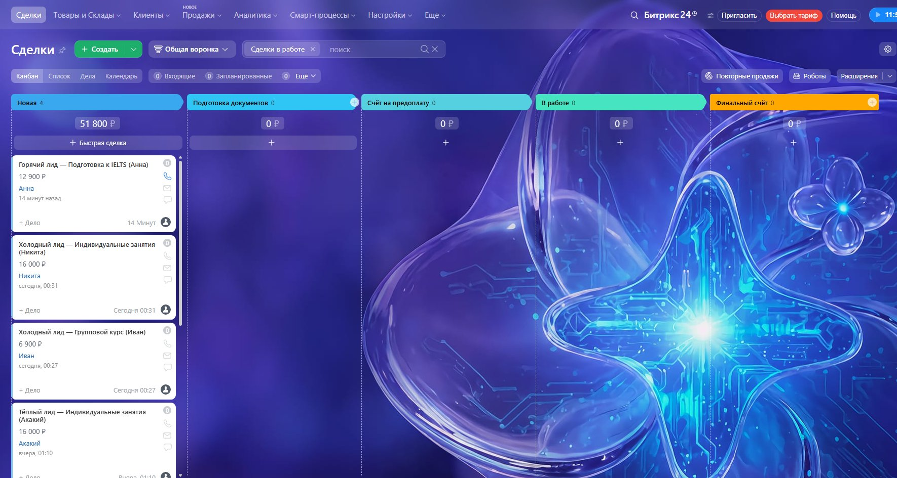
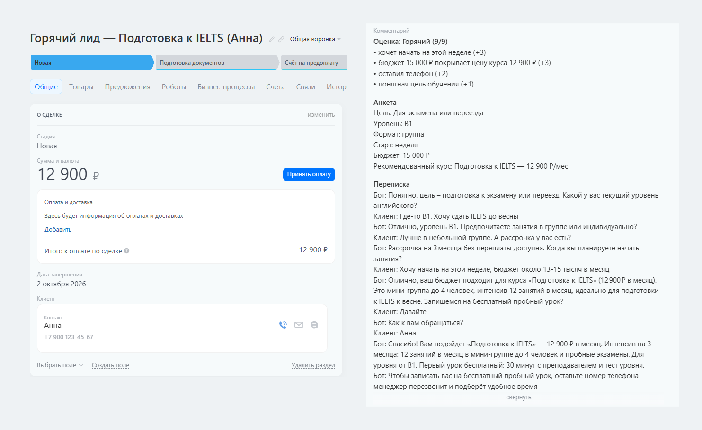

# ИИ-менеджер по продажам с интеграцией Битрикс24 (Telegram-бот)

Бот сам ведёт первый разговор с клиентом: выясняет потребность, подбирает продукт, оценивает, насколько клиент «горячий», и передаёт готовый лид в Битрикс24 и менеджеру в Telegram.

**Попробовать:** [@malyshev_speakly_bot](https://t.me/malyshev_speakly_bot) · Автор: Максим Малышев, [@nfbl_c](https://t.me/nfbl_c)

> Готовое решение для онлайн-школ, курсов и любого бизнеса с входящими заявками. Показано на примере вымышленной онлайн-школы английского «Speakly».


## Что умеет

- **Квалифицирует заявку в живом диалоге.** ИИ по одному вопросу выясняет цель, уровень, формат, сроки, бюджет и имя. Если клиент отвечает сразу на несколько вопросов — всё запоминает и не переспрашивает. Если задаёт свой вопрос — сначала отвечает, строго по базе знаний.
- **Подбирает продукт** и приглашает на бесплатный пробный урок.
- **Оценивает лид:** горячий, тёплый или холодный. Оценка прозрачная — менеджер видит, за что начислены баллы (сроки, бюджет относительно цены, оставлен ли телефон).
- **Создаёт контакт и сделку в Битрикс24:** имя, телефон, Telegram, сумма, анкета, причины оценки и переписка с клиентом. Сделка сразу появляется в колонке «Новая» воронки.
- **Присылает карточку менеджеру в Telegram** со ссылкой на сделку в Битрикс24. Команда `/leads` — последние заявки.
- **Напоминает о себе** клиенту, который замолчал на середине (один раз, через заданное время).
- **Не теряет диалоги** при перезапуске — всё хранится в базе.
- **Работает и без ИИ:** если ключа нет или API недоступен, бот переходит на сценарий с вопросами по порядку.

| Диалог и анкета лида | Оценка лида |
|---|---|
|  |  |

## Настоящая сделка в Битрикс24

Снимки с тестового портала. Вымышленная клиентка Анна прошла диалог в боте, и сделка сама появилась в воронке: сумма, контакт и комментарий с оценкой, анкетой и перепиской.





## Пример оценки

```
Горячий лид · 9/9
Клиент: Анна (@anna_k)
Телефон: +79001234567
Курс: Подготовка к IELTS — 12 900 ₽/мес

Почему такая оценка:
• хочет начать на этой неделе (+3)
• бюджет 15 000 ₽ покрывает цену курса 12 900 ₽ (+3)
• оставил телефон (+2)
• понятная цель обучения (+1)
```

## Стек

Python 3.11+, aiogram 3, SQLite, Битрикс24 REST API (входящий вебхук), LLM API: Groq, OpenRouter, OpenAI, Claude, Gemini или GigaChat — переключается в `.env`.

## Запуск

1. Создайте бота у [@BotFather](https://t.me/BotFather) и скопируйте токен.
2. `pip install -r requirements.txt`
3. Скопируйте `.env.example` в `.env`, впишите `BOT_TOKEN` и ключ ИИ (готовые настройки для бесплатного Groq — в `.env.example`).
4. `python bot.py`
5. Отправьте боту `/myid` и впишите ID в `ADMIN_CHAT_ID` — туда будут приходить лиды.

### Подключение Битрикс24

В Битрикс24: **Разработчикам → Другое → Входящий вебхук**, права — **CRM**. Скопируйте адрес вебхука в `BITRIX_WEBHOOK`. Без него бот тоже работает: лиды сохраняются в базе и приходят менеджеру в Telegram.

## Как адаптировать под клиента

- `data/school.json` — название, продукты и цены;
- `data/faq.md` — частые вопросы, из которых ИИ берёт ответы;
- `qualifier.py` — какие вопросы задавать и как считать оценку лида.

## Структура

```
bot.py        — диалог с клиентом, приём телефона, передача заявки, напоминания
qualifier.py  — ИИ-квалификация: промпт, извлечение анкеты, подбор курса, оценка лида
crm.py        — Битрикс24: контакт и сделка, карточка для менеджера
llm.py        — работа с LLM-провайдерами
db.py         — диалоги и лиды (SQLite)
school.py     — данные школы и база знаний
deploy/       — установка на сервер (systemd)
```

## Развёртывание на сервере

```
ssh root@SERVER mkdir -p /opt/leads-bot
scp .env root@SERVER:/opt/leads-bot/.env
ssh root@SERVER 'bash -s' < deploy/setup.sh
```

## Нужен такой бот для вашего бизнеса?

Настрою под ваши продукты, вопросы квалификации и вашу CRM (Битрикс24, amoCRM или Google Таблицы) — [@nfbl_c](https://t.me/nfbl_c).
